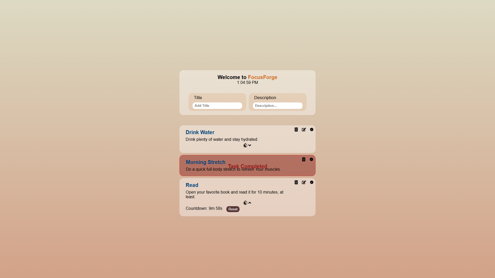

# FocusForge



**FocusForge**
is a task-management web application designed to help users plan, track, and refine their daily focus sessions. It's a to-do list app built by [React](https://react.dev/) + [Vite](https://vite.dev/) for practice and learning purposes, but you'll find it fun to use, I'm sure 😅.

It provides an intuitive interface for setting goals, managing tasks, and monitoring progress — all within a sleek, responsive design.

## Features

- Smart Task Management – Create, edit, and organize each task.

- Focus Timer – Stay productive using a built-in countdown system for focused work sessions.

- Responsive UI – Works smoothly across desktop and mobile devices.

- Lightweight Performance – Optimized build powered by modern front-end tools.

- User-friendly design & easy to use.

- Local Storage Support - Tasks are saved directly in your browser using built-in JavaScript storage.

## Tech Stack

- Language: JavaScript
- Framework: React **18.3.1** & Vite **5.4.1**
- Style: CSS
- State Management: React Context API
- Storage: Local Storage
- Deployment: [Vercel](https://vercel.com/)
- Version Control: Git + GitHub

## Live demo

You can always check the final version of FocusForge by clicking [here](https://focusforge-pb5ikggk1-pixedit-1760s-projects.vercel.app/)

## Installation & Setup

1. Clone the repository:

```
git clone https://github.com/pixedit-dev/FocusForge.git
```

2. Navigate to the project folder:

```
cd FocusForge
```

3. Install dependencies:

```
npm install
```

4. Run the development server:

```
npm run dev
```

## License

This project is open source and available under the [MIT License](LICENSE).

## Author

Developed by Milad — Front-End Developer

[GitHub](https://github.com/pixedit-dev)

_Personal portfolio coming soon!_
